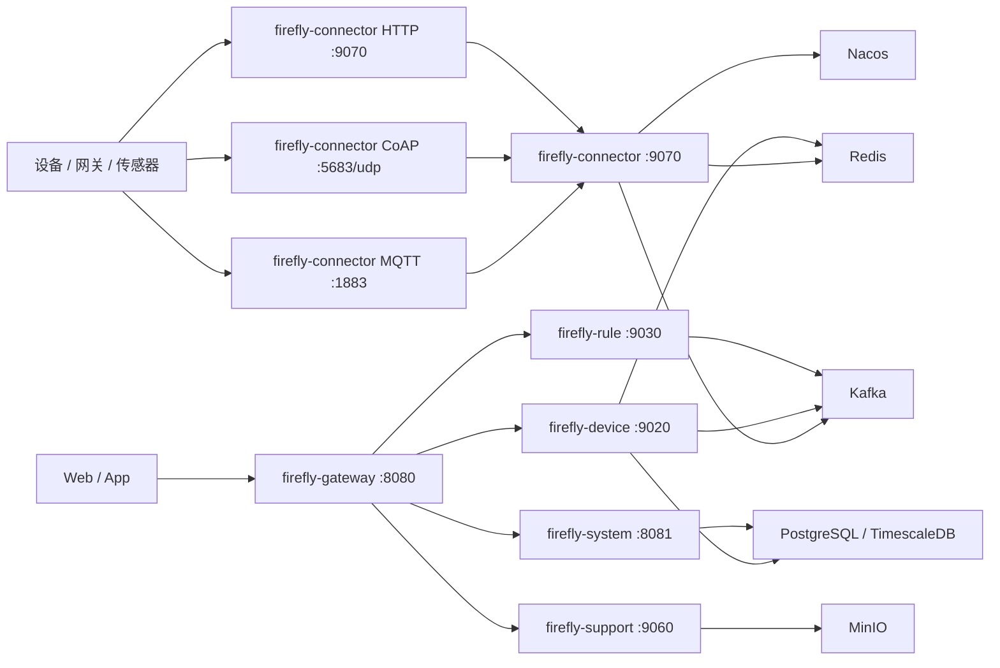

# Firefly IoT 架构文档

本文档描述当前代码实现对应的核心架构，重点覆盖微服务职责、设备消息链路、`firefly-connector` 内置 MQTT 方案，以及 Docker 部署与扩容方式。

## 1. 模块总览

| 模块 | 类型 | 默认端口 | 职责 |
| --- | --- | --- | --- |
| `firefly-common` | JAR | - | 公共常量、上下文、异常、消息模型 |
| `firefly-api` | JAR | - | Feign 接口与共享 DTO |
| `firefly-gateway` | Boot | 8080 | API 网关、动态路由、认证透传 |
| `firefly-system` | Boot | 8081 | 租户、用户、角色、权限、会话、菜单配置 |
| `firefly-device` | Boot | 9020 | 产品、设备、物模型、影子、下行消息、认证服务 |
| `firefly-rule` | Boot | 9030 | 规则引擎、告警 |
| `firefly-media` | Boot | 9040 | 视频监控、GB28181、ZLMediaKit 集成 |
| `firefly-data` | Boot | 9050 | 监控、分析、看板 |
| `firefly-support` | Boot | 9060 | 文件、通知、导出 |
| `firefly-connector` | Boot | 9070 | 协议接入层，内置 MQTT Broker、HTTP/CoAP 接入、动态注册 |

## 2. 总体拓扑



## 3. 设备消息链路

### 3.1 设备上行

1. 设备通过 MQTT、HTTP 或 CoAP 连接 `firefly-connector`。
2. `firefly-connector` 完成认证、Topic 解析、协议适配与消息编解码。
3. 上行消息写入 Kafka：
   - `device.property.report`
   - `device.event.report`
   - `device.lifecycle`
   - `device.message.up`
   - `device.ota.progress`
4. `firefly-device` 消费消息，更新设备状态、日志、影子，并继续投递规则引擎。

### 3.2 设备下行

1. 前端通过 `firefly-gateway` 调用 `firefly-device` 下发接口。
2. `firefly-device` 将消息写入 Kafka `device.message.down`。
3. `firefly-connector` 使用共享消费组消费下行消息。
4. `firefly-connector` 先从 Redis 查询设备当前连接路由：
   - 如果连接归属当前节点，直接通过内置 MQTT Broker 向设备下发。
   - 如果连接归属其他节点，先检查目标节点心跳，再通过 Redis Pub/Sub 转发到目标节点投递。
   - 如果目标节点已失活，会清理陈旧路由并尝试使用本地有效路由恢复投递。

### 3.3 动态注册

一型一密产品只能走动态注册流程：

1. 设备调用 `POST /api/v1/protocol/device/register`
2. `firefly-connector` 调用 `firefly-device` 认证服务完成产品级校验
3. 平台生成该设备的设备密钥
4. 设备再按一机一密方式建立 MQTT 连接

## 4. 内置 MQTT 设计

### 4.1 运行方式

- Broker 实现在 `firefly-connector` 内部，默认启用。
- 默认监听地址与端口由 `firefly.mqtt.host`、`firefly.mqtt.port` 控制，生产环境通过环境变量注入。
- 默认不开启持久化，若启用 `FIREFLY_MQTT_PERSISTENCE_ENABLED=true`，数据目录使用 `FIREFLY_MQTT_DATA_PATH`。

### 4.2 节点路由与扩容

- 每个 `connector` 节点启动后都会生成或读取唯一 `nodeId`。
- `nodeId` 为空时，优先取 `POD_NAME`、`HOSTNAME`、`HOST`，最后退化到本机主机名，并拼接 MQTT 端口。
- 设备在线路由以 `deviceId` 为键保存在 Redis，并设置 TTL。
- 每个节点周期性刷新：
  - 自身心跳键
  - 本地连接路由 TTL
- 下行消息使用 Kafka 共享消费组，而不是每个节点各自重复消费。

### 4.3 第三方 Broker 兼容

`firefly-connector` 仍保留 Webhook 控制器 `MqttWebhookController`：

- `POST /api/v1/protocol/mqtt/auth`
- `POST /api/v1/protocol/mqtt/acl`
- `POST /api/v1/protocol/mqtt/message`
- `POST /api/v1/protocol/mqtt/disconnect`

这些接口用于兼容外部 MQTT Broker 的 HTTP 回调模式，但当前默认部署不再需要 EMQX。

## 5. Kafka Topics

| Topic | 生产者 | 消费者 | 用途 |
| --- | --- | --- | --- |
| `device.property.report` | `firefly-connector` | `firefly-device` | 属性上报 |
| `device.event.report` | `firefly-connector` | `firefly-device` | 事件上报 |
| `device.lifecycle` | `firefly-connector` | `firefly-device` | 上下线事件 |
| `device.message.up` | `firefly-connector` | `firefly-device` | 通用上行消息 |
| `device.message.down` | `firefly-device` | `firefly-connector` | 设备下行消息 |
| `device.ota.progress` | `firefly-connector` | `firefly-device` | OTA 进度 |
| `rule.engine.input` | `firefly-device` | `firefly-rule` | 规则引擎输入 |

## 6. Connector 对外入口

| 路径 | 说明 |
| --- | --- |
| `POST /api/v1/protocol/device/register` | 一型一密动态注册 |
| `POST /api/v1/protocol/http/**` | HTTP 设备数据接入 |
| `POST /api/v1/protocol/coap/**` | CoAP 桥接 |
| `POST /api/v1/protocol/mqtt/auth` | 外部 Broker 认证回调兼容接口 |
| `POST /api/v1/protocol/mqtt/acl` | 外部 Broker ACL 回调兼容接口 |
| `POST /api/v1/protocol/mqtt/message` | 外部 Broker 消息回调兼容接口 |
| `POST /api/v1/protocol/mqtt/disconnect` | 外部 Broker 断连回调兼容接口 |

## 7. 前端与网关路由

所有业务 API 统一经过 `firefly-gateway`，约定如下：

```text
/{SHORTNAME}/api/v1/**  ->  lb://firefly-{shortName}
/open/{SHORTNAME}/api/v1/**  ->  lb://firefly-{shortName}  (AppKey OpenAPI)
```

典型映射：

| 前端前缀 | 目标服务 |
| --- | --- |
| `/SYSTEM/api/v1/**` | `firefly-system` |
| `/DEVICE/api/v1/**` | `firefly-device` |
| `/RULE/api/v1/**` | `firefly-rule` |
| `/MEDIA/api/v1/**` | `firefly-media` |
| `/DATA/api/v1/**` | `firefly-data` |
| `/SUPPORT/api/v1/**` | `firefly-support` |
| `/CONNECTOR/api/v1/**` | `firefly-connector` |

OpenAPI 外部调用统一收口为：

| 外部前缀 | 目标服务 |
| --- | --- |
| `/open/SYSTEM/api/v1/**` | `firefly-system` |
| `/open/DEVICE/api/v1/**` | `firefly-device` |
| `/open/RULE/api/v1/**` | `firefly-rule` |
| `/open/MEDIA/api/v1/**` | `firefly-media` |
| `/open/DATA/api/v1/**` | `firefly-data` |
| `/open/SUPPORT/api/v1/**` | `firefly-support` |
| `/open/CONNECTOR/api/v1/**` | `firefly-connector` |

## 8. Docker 部署

### 8.1 部署目录

```text
deploy/
├─ .env.example
├─ Dockerfile
├─ Dockerfile.web
├─ docker-compose.yml
├─ docker-compose.prod.yml
├─ deploy.sh
└─ nginx/default.conf
```

### 8.2 `docker-compose.yml`

- 用途：本地开发基础设施。
- 默认启动：PostgreSQL、Redis、Kafka、Nacos、MinIO、Sentinel。
- 可选 `connector` Profile：在本地需要容器化 MQTT 入口时再启用。

### 8.3 `docker-compose.prod.yml`

- 用途：单机生产部署示例。
- 暴露端口：
  - Web: `80`
  - Gateway: `8080`
  - Connector HTTP: `9070`
  - MQTT: `1883`
  - CoAP: `5683/udp`
- 默认不再包含 EMQX 服务。

### 8.4 关键环境变量

| 变量 | 默认值 | 说明 |
| --- | --- | --- |
| `FIREFLY_MQTT_ENABLED` | `true` | 启用内置 MQTT Broker |
| `FIREFLY_MQTT_HOST` | `0.0.0.0` | MQTT 监听地址 |
| `FIREFLY_MQTT_PORT` | `1883` | MQTT 监听端口 |
| `FIREFLY_MQTT_ALLOW_ANONYMOUS` | `false` | 是否允许匿名连接 |
| `FIREFLY_MQTT_PERSISTENCE_ENABLED` | `false` | 是否启用持久化 |
| `FIREFLY_MQTT_DATA_PATH` | `data/mqtt` | Broker 数据目录 |
| `FIREFLY_MQTT_MAX_MESSAGE_SIZE` | `65536` | 最大消息字节数 |
| `FIREFLY_MQTT_NODE_ID` | 空 | 节点唯一标识，留空自动生成 |
| `FIREFLY_MQTT_DOWNSTREAM_GROUP` | 空 | Kafka 下行共享消费组 |
| `FIREFLY_MQTT_ROUTE_TTL_SECONDS` | `120` | 路由 TTL |
| `FIREFLY_MQTT_ROUTE_REFRESH_INTERVAL_SECONDS` | `30` | 路由刷新周期 |
| `FIREFLY_MQTT_NODE_HEARTBEAT_TTL_SECONDS` | `45` | 节点心跳 TTL |
| `FIREFLY_MQTT_NODE_HEARTBEAT_INTERVAL_SECONDS` | `15` | 节点心跳刷新周期 |
| `FIREFLY_MQTT_DOWNSTREAM_QOS` | `1` | 下行 QoS |
| `FIREFLY_MQTT_RELAY_CHANNEL_PREFIX` | `connector:mqtt:downstream:` | Redis 转发通道前缀 |

### 8.5 单机与多机部署差异

- 单机 Docker Compose：直接将 `1883` 暴露给宿主机即可。
- 多实例部署：建议使用 Kubernetes 或其他编排平台，在外部放置 TCP 负载均衡，将流量转发到多个 `connector` 副本。
- 同一宿主机上多个 `connector` 副本不能直接绑定同一个宿主端口 `1883`。

## 9. 启动顺序建议

1. PostgreSQL、Redis、Kafka、Nacos、MinIO、Sentinel
2. `firefly-system`
3. `firefly-device`、`firefly-rule`、`firefly-media`、`firefly-data`、`firefly-support`
4. `firefly-connector`
5. `firefly-gateway`
6. `firefly-web`

## 10. 关联文档

- [README](README.md)
- [产品设计](docs/design/product-design.md)
- [设备管理详细设计](docs/design/detailed-design-device-management.md)
