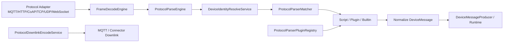

# Firefly IoT 自定义协议解析详细设计

> 版本: v2.1.0
> 日期: 2026-03-10
> 状态: Delivered

## 1. 设计目标

自定义协议解析模块已经完成一期尾项、二期、三期目标，当前设计文档以仓库内已落地实现为准，不再停留在预研口径。

本轮补充的重点设计约束如下：

- 前端页面尽量不向用户暴露系统数据库主键。
- 规则配置中的业务标识统一优先使用 `tenantCode` 与 `productKey`。
- 协议解析页优先采用下拉和模板，减少手工输入。
- 对复杂逻辑、页面联动和运行时交互补充必要注释与说明。

## 2. 范围总览

### 2.1 一期能力

- 协议解析规则定义、保存、发布、回滚、启停、版本历史。
- 设备定位器持久化与管理接口。
- MQTT、HTTP、WebSocket、CoAP、TCP、UDP 统一进入上行解析链路。
- TCP/UDP 分帧能力接入运行时。
- 上行在线调试能力。

### 2.2 二期能力

- 下行编码模型与编码测试接口。
- Script 模式下 `encode(ctx)` 执行。
- Plugin SPI、运行时插件注册表、插件重载与插件目录视图。
- 运行时指标采集与前端展示。
- MQTT 下行编码接入自定义编码链路。

### 2.3 三期能力

- 租户默认规则 `TENANT` scope。
- 灰度发布 `ALL / DEVICE_LIST / HASH_PERCENT`。
- 轻量可视化编排 `visualConfigJson` 与一键生成 `scriptContent`。
- 运行时面板、插件目录、插件热重载。
- 设备模拟器内直连的自定义协议验证入口：
  - HTTP / MQTT / CoAP / WebSocket / TCP / UDP 共用一套“自定义协议验证”面板。
  - WebSocket / TCP / UDP 在模拟器侧统一补齐 `ProductKey / DeviceName / 定位器` 绑定入口，用于真实运行态联调。
  - 面板内的直接调试继续复用 `/api/v1/protocol-parsers/{id}/test` 与 `/encode-test`，不再额外造一套模拟器私有调试接口。

## 3. 核心设计

### 3.1 作用域模型

规则仍然保留后端内部作用域字段：

- `scopeType`
  - `PRODUCT`
  - `TENANT`
- `scopeId`
  - 后端内部锚点字段。
  - `PRODUCT` 规则默认取 `productId`。
  - `TENANT` 规则默认取当前租户 ID。

设计约束：

- `scopeId` 继续作为后端内部归属字段存在。
- 前端不再把 `scopeId` 当作用户显式输入项。
- 页面统一展示业务可识别信息：
  - 租户默认级显示 `tenantCode`
  - 产品级显示 `产品名称 + productKey`

这样可以避免让用户理解和依赖内部主键，同时不破坏现有后端数据模型与查询逻辑。

### 3.2 协议与传输方式的区分

`protocol` 与 `transport` 不是重复字段，职责如下：

- `protocol`
  - 表示协议族或适配器类别。
  - 例如 `TCP_UDP`、`MQTT`、`HTTP`。
- `transport`
  - 表示运行时实际传输通道。
  - 例如 `TCP`、`UDP`、`MQTT`、`HTTP`。

重点说明：

- 在 MQTT、HTTP、CoAP 等场景下，这两个字段的值看起来可能相同，但语义并不相同。
- 在 TCP/UDP 适配器下，`protocol = TCP_UDP`，而 `transport` 需要明确区分 `TCP` 或 `UDP`。
- 运行时匹配器和分帧引擎都需要这两个维度，因此前端保留双字段，但补充中文说明，降低误解。

### 3.3 业务唯一键优先原则

为了减少主键暴露，当前页面采用以下设计：

- 产品选择使用下拉框，标签展示 `产品名称 (productKey)`。
- 规则列表、弹窗标题、调试入口不再展示规则内部 ID。
- `parserConfigJson` 会自动补齐：
  - `tenantCode`
  - `productKey`

自动补齐时机：

- 新建规则弹窗初始化。
- 编辑已有规则加载详情。
- 应用预置模板。
- 点击解析配置预设按钮。
- 编辑过程中切换作用域或产品。
- 最终提交保存前再次兜底同步。

兜底原则：

- 产品级规则补齐 `tenantCode + productKey`。
- 租户默认级规则保留 `tenantCode`，并主动移除 `productKey`，避免脏值残留。

### 3.4 前端交互优化

自定义协议解析页的交互设计遵循“优先选择、少填少错”的原则：

- 筛选条件优先使用下拉选择。
- 新建和编辑规则支持模板一键填充。
- `matchRuleJson`、`frameConfigJson`、`parserConfigJson`、`releaseConfigJson` 均提供预设按钮。
- 插件模式优先从运行时已安装插件或插件目录中选择 `pluginId` 和版本。
- 调试弹窗中的产品选择改为下拉，不再要求手输产品 ID。
- 页面文案统一中文化，与整站风格保持一致。

### 3.5 复杂联动说明

前端页存在两个必须明确记录的复杂联动点：

1. `parserConfigJson` 的业务标识同步
   - 当作用域、产品或租户上下文变化时，页面会同步修正 `tenantCode` 与 `productKey`。
   - 保存前再次做一次兜底注入，确保最终持久化配置不残留错误业务标识。

2. 调试场景的租户默认规则选择
   - 租户默认规则本身不绑定单一产品。
   - 但调试和运行时匹配通常需要明确产品上下文。
   - 因此前端在调试弹窗中保留“调试产品”选择项。

## 4. 运行时执行链路

执行特性：

- 上行链路与调试接口共用解析核心逻辑。
- 下行编码与编码测试接口共用编码链路。
- 设备模拟器中的“直接调试”与“运行态联调”继续共用同一套规则定义、协议上下文和编码/解析核心。
- 已发布版本才参与运行时匹配。
- 产品级规则优先于租户默认级规则。
- 灰度发布在“已发布规则集合内部”进行命中决策。

## 5. 数据与接口设计

### 5.1 规则定义关键字段

- `productId`
  - 后端内部关联产品。
  - 前端不以裸 ID 向用户展示。
- `scopeType`
  - 规则作用域。
- `scopeId`
  - 后端内部字段，前端隐藏。
- `protocol`
  - 协议族。
- `transport`
  - 运行时传输方式。
- `direction`
  - `UPLINK / DOWNLINK`
- `parserMode`
  - `SCRIPT / PLUGIN / BUILTIN`
- `frameMode`
  - `NONE / DELIMITER / FIXED_LENGTH / LENGTH_FIELD`
- `parserConfigJson`
  - 运行时 `ctx.config`
  - 当前要求包含业务唯一键信息

### 5.2 前端与后端契约

本次优化不改动后端主接口契约：

- 管理接口仍按规则 `id` 读写详情、发布、回滚、启停。
- 前端页面只是不再把这些内部主键直接暴露给用户。
- 调试与保存提交仍可以继续传递后端所需内部字段。

这样可以兼顾：

- 已有服务逻辑稳定性
- 前端用户体验
- 后续逐步向业务唯一键演进的可实施性

## 6. 页面字段口径

### 6.1 “作用域 ID”

- 含义：后端内部归属字段。
- 当前口径：用户无需手工填写。
- 页面行为：隐藏，不再作为主交互项。

### 6.2 “协议”

- 用于选择协议族或适配器类别。
- 例：`TCP_UDP`、`MQTT`、`HTTP`。

### 6.3 “传输方式”

- 用于选择运行时实际通道。
- 例：`TCP`、`UDP`、`MQTT`、`HTTP`。

### 6.4 “调试产品”

- 产品级规则会自动带出对应产品。
- 租户默认级规则调试时需要用户明确选择产品上下文。

### 6.5 设备模拟器联调入口

- 设备模拟器按当前模拟设备的协议自动推导调试上下文：
  - HTTP -> `protocol=HTTP` / `transport=HTTP`
  - MQTT -> `protocol=MQTT` / `transport=MQTT`
  - CoAP -> `protocol=COAP` / `transport=COAP`
  - WebSocket -> `protocol=WEBSOCKET` / `transport=WEBSOCKET`
  - TCP -> `protocol=TCP_UDP` / `transport=TCP`
  - UDP -> `protocol=TCP_UDP` / `transport=UDP`
- WebSocket / TCP / UDP 不再只停留在“原始连通性测试”：
  - 模拟器高级配置新增“平台身份绑定”卡片，统一填写 `ProductKey / DeviceName / 定位器`。
  - WebSocket 连接参数与 TCP/UDP `_fireflyBinding` 保留报文都会复用这套业务身份。
  - 因此同一套配置可以同时支撑设备消息工作台下行、真实运行态解析、自定义协议验证面板的直接调试。
- 模拟器内的直接调试默认按当前设备的 `ProductKey / DeviceName` 带出产品上下文；如果设备未补齐业务身份，只保留原始连通性能力，不再误导用户以为已经进入真实协议解析链路。

### 6.6 本地最小联调基线

- 仓库内额外提供本地初始化脚本 `firefly-simulator/scripts/bootstrap-custom-protocol-samples.mjs`，用于在空白本地环境里快速补齐联调基线。
- 基线固定收口为 1 个 `CUSTOM` 产品 + 3 台样本设备：
  - `sim_custom_ws_01`
  - `sim_custom_tcp_01`
  - `sim_custom_udp_01`
- 每种 transport 固定创建 1 条 `UPLINK` 与 1 条 `DOWNLINK` 规则，并在 `parserConfigJson` 中写入 `sampleKey = SIMULATOR_CUSTOM_PROTOCOL_BASELINE_V1`，便于脚本后续幂等更新。
- 规则发布方式统一使用 `DEVICE_LIST`，只对白名单样本设备生效，避免本地样本规则误伤用户自己的其他测试设备。
- 脚本除了创建平台样本外，还会生成模拟器导入文件 `samples/custom-protocol-devices.local.json`，让“平台样本”和“模拟器样本”始终保持同一套 `ProductKey / DeviceName / 定位器`。

## 7. 设计结果

通过本轮收口，自定义协议解析功能在设计上达到以下状态：

- 功能范围完整覆盖一期、二期、三期目标。
- 页面交互符合“少输入、少暴露主键、优先业务键”的规则。
- 复杂联动点已在代码和文档中补充说明。
- 既保留现有后端稳定契约，又把前端展示口径收敛到业务可理解信息。
- 自定义协议规则的页面调试、设备模拟器直接调试、设备模拟器运行态联调三条路径已统一收口到同一套协议上下文与业务身份口径。

## 2026-03-12 Runtime Hardening Update

### Scope

This update aligns management, debug, and runtime behavior for custom protocol parsing and closes several unsafe edge cases.

### Key Design Changes

- `errorPolicy` is now enforced in runtime parse decisions:
  - `ERROR`: mark parse failure and continue trying later candidates; if no candidate succeeds and no RAW fallback is allowed, return handled-empty.
  - `DROP`: stop immediately and return handled-empty.
  - `RAW_DATA`: continue candidate traversal and allow raw pipeline fallback (`notHandled`) when no parser succeeds.
- Parser candidate traversal no longer short-circuits on first failure under `ERROR`; later matching candidates can still succeed.
- TCP/UDP frame decode now filters parser definitions by release strategy (`ALL` / `DEVICE_LIST` / `HASH_PERCENT`) when device context is known.
- Session frame reassembly introduces bounded remainder protection:
  - supports `frameConfig.maxBufferedBytes`
  - overflow clears session remainder and drops the oversized partial frame.
- Debug frame splitting is isolated from production sessions; debug calls no longer write to runtime TCP/UDP session buffers.
- `BUILTIN` parser mode is explicitly rejected in management validation. Current supported modes are `SCRIPT` and `PLUGIN`.
- Script parser execution now runs in a bounded executor with queue limits and timeout-triggered cancellation to prevent unbounded resource growth.

### Runtime Notes

- Existing `SCRIPT` and `PLUGIN` published rules remain compatible.
- Rules configured with `parserMode=BUILTIN` must be migrated to `SCRIPT` or `PLUGIN`.

## 2026-03-13 Debug UX Alignment

### Scope

This update aligns debug interaction with the repository rule that user-facing protocol parser operations should prefer business identifiers and should not expose unsupported primary-key flows.

### Key Changes

- Uplink debug no longer exposes manual `deviceId` or `deviceName` selection in the page.
  - The previous page interaction suggested that users could override device identity manually.
  - Actual uplink debug execution still identifies devices from payload, topic, headers, and locator logic.
  - The old UI therefore created a false sense of control and has been removed.
- Downlink debug now uses `deviceName` as the visible selector and narrows candidates by selected product.
  - This keeps the user interaction on `productKey + deviceName`.
  - It also reduces accidental cross-product device selection.
- Device service resolves selected `deviceName` back to internal device context before invoking connector encode debug.
  - Runtime execution still uses internal device context.
  - User-facing interaction stays on business keys only.
- Uplink debug identity output no longer returns `deviceId`.
  - Debug results only keep business-readable identity fields.

### Design Result

- The protocol parser page no longer advertises unsupported uplink debug behavior.
- Downlink debug follows the same business-key-first design as rule editing and product selection.
- Legacy `deviceIds` release config is no longer part of the supported model; stored rules should be cleaned and rewritten to `deviceNames`.

## 2026-03-13 协议解析抽屉分步化改造

### 背景

- 协议解析规则的新建和编辑抽屉承载了模板、作用域、协议匹配、拆帧、解析实现、可视化流、脚本或插件、发布策略等完整配置。
- 原页面把全部字段堆叠在一个长抽屉里，用户需要频繁滚动，难以判断当前配置到了哪一部分，也不利于复杂表单的逐步校验。
- 这与仓库内已经明确执行的“复杂表单使用抽屉，过长抽屉需要按模块拆分为步骤”的交互规则不一致。

### 设计目标

- 将协议解析规则抽屉拆分为可前进、可回退的分步流程。
- 保持现有后端保存契约、模板能力、JSON 预设能力和脚本/插件模式不变。
- 避免切换步骤时丢失已填写内容。
- 在最终保存前提供集中预览，降低误配概率。

### 方案

抽屉内统一改为五步：

1. 模板与作用域
2. 协议与匹配
3. 解析实现
4. 发布策略
5. 预览确认

关键设计点：

- 顶部使用 `Steps` 展示当前进度，并允许回到已完成步骤继续调整。
- 每一步只展示与当前模块相关的字段，降低信息密度。
- 下一步前只校验当前步骤所需字段，不提前触发后续复杂 JSON 或脚本校验。
- 最终保存前展示关键摘要与 JSON / 脚本 / 插件 / 发布配置预览。

### 实现约束

- 主表单移除 `preserve={false}`，确保步骤切换时字段值不会被卸载清空。
- 作用域、产品、模板、脚本/插件模式等现有联动逻辑继续复用，不调整后端接口入参结构。
- 发布策略、解析配置、拆帧配置等预设按钮继续保留，但按步骤归位到对应模块中。

### 结果

- 新建协议解析规则时，用户可以先完成范围选择，再逐步进入协议匹配、解析实现和发布配置。
- 编辑已有规则时复用同一套步骤式抽屉，页面行为保持一致。
- 页面交互与仓库抽屉规则保持一致，复杂表单可读性与可维护性同步提升。

## 2026-03-13 协议解析编辑器增强

### 背景

- 协议解析规则里存在多段 JSON 和脚本配置，原先仅使用普通 `TextArea`。
- 普通多行输入框缺少语法高亮、结构提示和脚本补全，复杂规则维护成本偏高，也容易因为 JSON 或脚本细节写错而反复调试。

### 方案

- 在前端新增通用 `CodeEditorField` 组件，基于 Monaco Editor 封装。
- 协议解析页的以下编辑区统一替换为代码编辑器：
  - `matchRuleJson`
  - `frameConfigJson`
  - `parserConfigJson`
  - `visualConfigJson`
  - `scriptContent`
  - `releaseConfigJson`

### 设计细节

- JSON 字段启用语法高亮、格式化和字段级自动提示。
- 依据不同字段的语义，提供差异化 schema 和补全：
  - 匹配规则补全 `topicPrefix`、`headerEquals` 等关键属性
  - 拆帧配置补全 `delimiterHex`、`fixedLength`、`maxBufferedBytes`
  - 解析配置补全 `defaultTopic`、`tenantCode`、`productKey`
  - 发布配置补全 `deviceNames`、`percent`
- 编辑器运行时仅装载协议解析页实际使用的能力：
  - JSON schema / 校验 / 补全
  - JavaScript 语法高亮
  - 业务脚本片段补全
- 不再把 Monaco 的全量语言能力打进单一页面 chunk，避免协议解析页首次进入时额外加载大量无关语言资源。
- 脚本字段启用 JavaScript 高亮，并增加 `parse(ctx)`、`encode(ctx)` 代码片段和 `ctx` 上下文字段提示。

### 性能处理

- 编辑器组件通过懒加载引入，只在进入相关步骤时下载 Monaco 资源，避免把编辑器整体打进协议解析页主渲染路径。

### 结果

- 协议解析页从“纯文本录入”升级为“结构化代码编辑”体验。
- JSON 与脚本配置更容易阅读、补全和维护，能明显降低复杂规则的配置门槛。

## 2026-03-13 协议解析页面结构收口

### 背景

- 协议解析页面同时承载规则维护、筛选、运行时指标、插件目录和插件运维操作。
- 在同一屏连续展示总览、筛选、运行时面板和规则表格后，主任务不够聚焦，规则维护视角容易被运行时信息打断。

### 调整方案

- 页面顶部增加统一“概览卡片”，集中展示：
  - 当前租户
  - 当前产品筛选上下文
  - 规则总数
  - 已加载插件数量
  - 核心统计指标
- 概览卡片在页面中以“页面总览”命名，始终展示，不受标签页切换影响。
- 页面主体改为双标签页：
  - `规则维护`
  - `运行时状态`
- `规则维护` 标签页仅保留“筛选条件”和规则列表，避免和运行时信息混排。

### 设计结果

- 默认进入页面时先聚焦规则维护，不再和运行时面板混排。
- 运行时插件、指标和重载操作被收口到独立标签页，维护逻辑更清晰。
- 顶部总览保留关键信息，避免切换标签后丢失上下文。
