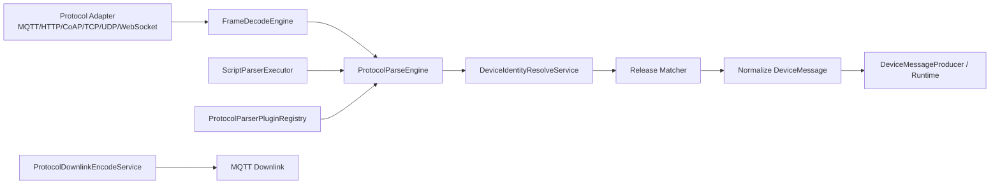

# Firefly IoT 自定义协议解析详细设计

> 版本: v2.0.0  
> 日期: 2026-03-10  
> 状态: Delivered  
> 关联实现: `8bbc92a feat: complete custom protocol parser runtime`

## 1. 文档目的

本文档描述 Firefly IoT 自定义协议解析能力的最终落地方案，覆盖一期尾项、二期、三期的完整实现状态，供后续开发、联调、运维和测试使用。

本版本不再停留在设计预案，而是以当前仓库已落地代码为准。

## 2. 最终交付范围

### 2.1 一期

- 协议解析规则定义、版本历史、发布、回滚、启停。
- 设备定位器 `device_locators` 持久化与管理接口。
- TCP/UDP 分帧能力接入运行时。
- MQTT、HTTP、WebSocket、CoAP、TCP、UDP 统一接入解析引擎。
- 上行解析在线调试。

### 2.2 二期

- 下行编码能力。
- Script 模式下的 `encode(ctx)` 执行。
- Plugin SPI、运行时插件注册表、插件重载。
- 运行时指标采集。
- MQTT 下行消息接入自定义编码链路。

### 2.3 三期

- 租户默认规则 `TENANT` scope。
- 灰度发布能力:
  - `ALL`
  - `DEVICE_LIST`
  - `HASH_PERCENT`
- 最小可用可视化编排:
  - 前端维护 `visualConfigJson`
  - 一键生成 `scriptContent`
- 插件目录与插件目录视图:
  - classpath 内置插件
  - `plugins/protocol-parsers/*.jar`

## 3. 模块结构

### 3.1 新增与增强模块

- `firefly-plugin-api`
  - 提供协议插件 SPI、上下文模型、返回模型。
- `firefly-device`
  - 提供规则管理、调试、发布、版本、设备定位器、运行时代理接口。
- `firefly-connector`
  - 提供协议解析引擎、分帧引擎、插件注册、下行编码、指标、灰度匹配。
- `firefly-web`
  - 提供协议解析管理页、运行时面板、设备定位器管理入口。

### 3.2 关键代码位置

- 规则服务: `firefly-device/.../ProtocolParserService.java`
- 调试服务: `firefly-device/.../ProtocolParserDebugService.java`
- 运行时接口: `firefly-device/.../ProtocolParserRuntimeController.java`
- 设备定位器: `firefly-device/.../DeviceLocatorService.java`
- 解析引擎: `firefly-connector/.../ProtocolParseEngine.java`
- 分帧引擎: `firefly-connector/.../FrameDecodeEngine.java`
- 下行编码: `firefly-connector/.../ProtocolDownlinkEncodeService.java`
- 插件注册表: `firefly-connector/.../ProtocolParserPluginRegistry.java`
- 前端页面: `firefly-web/src/pages/protocol-parser/ProtocolParserPage.tsx`

## 4. 核心设计

### 4.1 执行链路



### 4.2 规则优先级

当前实现按以下顺序生效:

1. 产品规则优先于租户默认规则。
2. 灰度规则优先于 `ALL` 规则。
3. 已发布版本才会参与运行时匹配。
4. `TENANT` scope 规则在运行时通过产品上下文补齐生效范围。

### 4.3 解析模式

- `SCRIPT`
  - 使用 GraalJS。
  - 上行入口 `parse(ctx)`。
  - 下行入口 `encode(ctx)`。
- `PLUGIN`
  - 通过 `ProtocolParserPlugin` SPI 接入。
  - 支持解析和编码双向能力。
- `BUILTIN`
  - 后端保留兼容值。
  - 当前前端不再暴露，避免误配。

## 5. 数据模型

### 5.1 规则定义表增强

迁移文件:

- `firefly-device/src/main/resources/db/migration/V20__enhance_protocol_parser_runtime.sql`

当前关键字段:

- `product_id`
  - 允许为空。
  - `PRODUCT` scope 时必填。
  - `TENANT` scope 时为空。
- `scope_type`
  - `PRODUCT`
  - `TENANT`
- `direction`
  - `UPLINK`
  - `DOWNLINK`
- `parser_mode`
  - `SCRIPT`
  - `PLUGIN`
  - `BUILTIN`
- `visual_config_json`
  - 可视化编排结构化配置。
- `release_mode`
  - `ALL`
  - `DEVICE_LIST`
  - `HASH_PERCENT`
- `release_config_json`
  - 灰度配置。

### 5.2 设备定位器表

表名: `device_locators`

用途:

- 按 `locator_type + locator_value` 定位设备。
- 支持 IMEI、ICCID、MAC、SERIAL 等任意业务标识。
- 同一产品下唯一。

## 6. 接口设计

### 6.1 管理接口

#### 协议规则

- `POST /api/v1/protocol-parsers`
- `POST /api/v1/protocol-parsers/list`
- `GET /api/v1/protocol-parsers/{id}`
- `GET /api/v1/protocol-parsers/{id}/versions`
- `PUT /api/v1/protocol-parsers/{id}`
- `POST /api/v1/protocol-parsers/{id}/test`
- `POST /api/v1/protocol-parsers/{id}/encode-test`
- `POST /api/v1/protocol-parsers/{id}/publish`
- `POST /api/v1/protocol-parsers/{id}/rollback/{version}`
- `PUT /api/v1/protocol-parsers/{id}/enable`
- `PUT /api/v1/protocol-parsers/{id}/disable`

#### 运行时管理

- `GET /api/v1/protocol-parsers/runtime/plugins`
- `POST /api/v1/protocol-parsers/runtime/plugins/reload`
- `GET /api/v1/protocol-parsers/runtime/plugins/catalog`
- `GET /api/v1/protocol-parsers/runtime/metrics`

#### 设备定位器

- `GET /api/v1/devices/{deviceId}/locators`
- `POST /api/v1/devices/{deviceId}/locators`
- `PUT /api/v1/devices/{deviceId}/locators/{locatorId}`
- `DELETE /api/v1/devices/{deviceId}/locators/{locatorId}`

### 6.2 内部运行时接口

- `POST /api/v1/internal/protocol-parsers/debug`
- `POST /api/v1/internal/protocol-parsers/debug-encode`
- `GET /api/v1/internal/protocol-parsers/runtime/plugins`
- `POST /api/v1/internal/protocol-parsers/runtime/plugins/reload`
- `GET /api/v1/internal/protocol-parsers/runtime/plugins/catalog`
- `GET /api/v1/internal/protocol-parsers/runtime/metrics`

## 7. Script 与 Plugin 约定

### 7.1 上行脚本

```javascript
function parse(ctx) {
  return {
    identity: {
      mode: "BY_LOCATOR",
      locatorType: "IMEI",
      locatorValue: "860000000000001"
    },
    messages: [
      {
        type: "PROPERTY_REPORT",
        topic: ctx.topic,
        payload: { temperature: 23.5 },
        timestamp: Date.now()
      }
    ]
  };
}
```

### 7.2 下行脚本

```javascript
function encode(ctx) {
  return {
    topic: ctx.topic || "/down/property",
    payloadText: JSON.stringify(ctx.payload),
    payloadEncoding: "JSON"
  };
}
```

### 7.3 Plugin SPI

关键接口位于:

- `firefly-plugin-api/.../ProtocolParserPlugin.java`

能力特点:

- 可声明是否支持解析。
- 可声明是否支持编码。
- 通过 `ServiceLoader` 或外部 JAR 装载。

## 8. 分帧设计

当前运行时已支持:

- `NONE`
- `DELIMITER`
- `FIXED_LENGTH`
- `LENGTH_FIELD`

当前实现策略:

- TCP: 支持按会话缓存半包、粘包。
- UDP: 按数据报天然边界处理。
- 分帧发生在解析前。
- 调试接口与正式链路使用同一套规则。

## 9. 灰度发布设计

### 9.1 模式

- `ALL`
  - 全量设备。
- `DEVICE_LIST`
  - 通过 `deviceIds` 或 `deviceNames` 命中。
- `HASH_PERCENT`
  - 按设备维度进行稳定哈希。

### 9.2 实现原则

- 灰度是在“已发布规则集合内部”匹配，不做复杂工作流编排。
- 同一产品可并存多条已发布规则，由匹配器和灰度器共同决策是否命中。

## 10. 前端能力

### 10.1 协议解析页

已支持:

- 产品规则与租户默认规则配置。
- 上行/下行方向切换。
- `SCRIPT/PLUGIN` 模式切换。
- 协议、传输方式、插件、消息类型等高频字段下拉化。
- 模板一键填充、JSON 预设填充、示例载荷填充。
- 上行调试与下行编码调试。
- 版本历史、发布、回滚、启停。
- 运行时指标、已安装插件、插件目录、热重载。
- 可视化配置 JSON 和一键脚本生成。

### 10.2 页面交互优化

本轮前端增强重点如下：

- 筛选区由手工输入改为下拉选择，降低协议名、传输方式拼写错误率。
- 规则编辑页增加常用场景快捷按钮，支持 MQTT 上行、TCP 上行、MQTT 下行、TCP 下行完整模板。
- `matchRuleJson`、`frameConfigJson`、`parserConfigJson`、`releaseConfigJson` 提供预设按钮，减少 JSON 手工编写量。
- 插件模式支持从运行时已安装插件和插件目录中选择 `pluginId` 与版本。
- 调试弹窗支持主题、消息类型、请求头、载荷示例一键填充，缩短联调路径。
- 页面文案统一中文化，保持与整站风格一致。

### 10.3 设备定位器入口

已在设备列表页提供“定位器”按钮，支持:

- 新增
- 编辑
- 删除
- 主定位器切换

## 11. 运行与运维

### 11.1 插件装载

支持两种来源:

- Connector classpath 内置插件。
- `plugins/protocol-parsers/*.jar`

内置示例:

- `DemoJsonBridgePlugin`

### 11.2 缓存刷新

规则发布、回滚、启停后:

- Device 服务发送协议规则变更事件。
- Connector 收到事件后刷新单产品或全量缓存。
- `TENANT` scope 规则通过 `productId=0` 事件触发全量失效。

### 11.3 指标

当前已采集:

- 解析成功/兜底/异常次数
- 编码成功/兜底/异常次数
- 调试成功/异常次数
- 平均解析耗时
- 平均编码耗时
- 平均调试耗时
- 按传输层维度统计的 parse/encode counters

## 12. 权限设计

当前相关权限:

- `protocol-parser:read`
- `protocol-parser:create`
- `protocol-parser:update`
- `protocol-parser:test`
- `protocol-parser:publish`
- `device:read`
- `device:update`

补充说明:

- 默认租户管理员权限已从 `application.yml` 移除。
- 默认权限集中在系统设置/数据库一处维护。

## 13. 验证结果

已通过验证:

- `cd firefly-web && npm run build`
- `mvn -pl firefly-device,firefly-connector -am test`
- `mvn -pl firefly-system -am -DskipTests compile`

## 14. 已知边界

- 当前可视化编排是“结构化配置生成脚本”的最小可用方案，不是完整拖拽式 DSL。
- `BUILTIN` 仍保留后端兼容值，但不建议继续扩展。
- 插件目录当前为本地目录方案，不包含远程下载、签名校验和版本治理中心。

## 15. 结论

自定义协议解析已完成从“规则配置”到“运行时执行”再到“调试、灰度、运维、前端管理”的全链路闭环，当前版本可以作为平台正式能力继续迭代，而不再属于预研或半成品状态。
