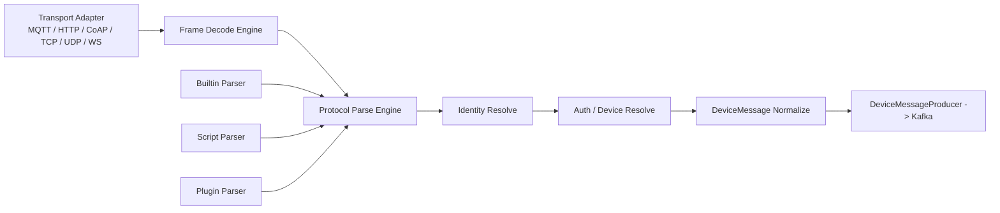
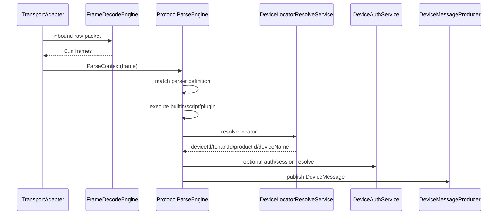

# Firefly-IoT 自定义协议解析扩展 - 详细设计文档

> **版本**: v1.0.0  
> **日期**: 2026-03-08  
> **状态**: Draft  
> **关联**: [产品设计文档](./product-design.md) §6.5 自定义协议扩展 SPI

---

## 目录

1. [模块概述](#1-模块概述)
2. [设计目标与范围](#2-设计目标与范围)
3. [现状分析](#3-现状分析)
4. [总体方案](#4-总体方案)
5. [核心概念与术语](#5-核心概念与术语)
6. [架构设计](#6-架构设计)
7. [数据模型设计](#7-数据模型设计)
8. [接口设计](#8-接口设计)
9. [Connector 详细设计](#9-connector-详细设计)
10. [Device 服务详细设计](#10-device-服务详细设计)
11. [脚本解析设计](#11-脚本解析设计)
12. [插件解析设计](#12-插件解析设计)
13. [拆包与会话设计](#13-拆包与会话设计)
14. [发布、缓存与多节点一致性](#14-发布缓存与多节点一致性)
15. [安全设计](#15-安全设计)
16. [运维与观测设计](#16-运维与观测设计)
17. [实施计划](#17-实施计划)
18. [风险与取舍](#18-风险与取舍)

---

## 1. 模块概述

### 1.1 模块定位

自定义协议解析扩展模块用于解决 Firefly-IoT 在非标准设备接入场景下的“消息拆包、设备定位、报文解析、统一消息归一化”问题。

目标不是替代现有 MQTT / HTTP / CoAP / TCP / UDP / WebSocket 接入层，而是在这些传输入口之后增加一层“可配置解析引擎”，让系统具备以下能力：

- 同一传输协议下支持多种厂商私有报文格式。
- 支持通过脚本快速定义产品级解析逻辑。
- 支持通过插件扩展复杂二进制协议和厂商 SDK。
- 支持按 `productKey/deviceName` 之外的标识定位设备，例如 `SN / MAC / IMEI / ICCID / clientId`。
- 支持解析规则版本化、发布、灰度、回滚和在线调试。

### 1.2 适用场景

| 场景 | 说明 |
|------|------|
| **MQTT 私有 payload** | Topic 保持标准，payload 为厂商私有 JSON / HEX / Base64 |
| **HTTP 私有报文上报** | 通过 HTTP 传入自定义 body，需要脚本映射为属性 / 事件 |
| **CoAP 自定义编码** | CoAP payload 为 CBOR / HEX / 私有二进制 |
| **TCP/UDP 私有协议** | 存在起始符、长度位、校验位、粘包半包、二进制字段解析 |
| **WebSocket 私有长连接** | 报文中只带 SN/MAC，需要先定位设备再归一化 |
| **下行应答编码** | 云端指令需要编码成厂商私有下行格式 |

### 1.3 非目标

- 不允许租户直接扩展新的底层网络监听器。
- 不允许租户上传任意 Java 代码执行。
- 一期不实现可视化拖拽式解析编排。
- 一期不覆盖 GB28181 / RTSP / Modbus 等已有强协议语义场景。

---

## 2. 设计目标与范围

### 2.1 目标

| 目标 | 说明 |
|------|------|
| **零侵入扩展** | 新增产品解析逻辑时，不修改 `firefly-connector` 现有协议适配代码 |
| **统一归一化** | 所有自定义协议最终统一输出为 `DeviceMessage` |
| **可热更新** | 新发布解析规则后，无需重启 connector |
| **可观测** | 每次解析可追踪到规则版本、执行耗时、结果摘要 |
| **可灰度** | 支持产品级启用、停用、回滚 |
| **安全可控** | 脚本沙箱隔离，插件仅系统运维可安装 |

### 2.2 范围

一期范围：

- 产品级上行解析规则。
- 脚本解析执行引擎。
- 设备定位能力。
- TCP/UDP 拆包规则。
- 在线调试接口。
- 规则版本化、发布、缓存刷新。

二期范围：

- 下行编码规则。
- 插件市场与插件生命周期管理页面。
- 多版本灰度发布。
- 规则依赖公共函数库与测试用例库。

---

## 3. 现状分析

### 3.1 当前实现现状

当前 connector 内，各协议入口直接完成解析并输出 `DeviceMessage`：

- `firefly-connector/.../protocol/HttpProtocolAdapter.java`
- `firefly-connector/.../protocol/CoapProtocolAdapter.java`
- `firefly-connector/.../protocol/MqttProtocolAdapter.java`
- `firefly-connector/.../protocol/tcpudp/TcpUdpProtocolAdapter.java`
- `firefly-connector/.../protocol/websocket/WebSocketProtocolAdapter.java`

这些实现存在以下问题：

| 问题 | 说明 |
|------|------|
| **解析逻辑写死** | 新增厂商私有格式需要改 Java 代码并重新发布 |
| **职责耦合** | 传输接入、拆包、设备定位、解析、投递混在同一类里 |
| **TCP/UDP 可扩展性弱** | 当前仅支持“尽量转 JSON，否则当 raw 文本” |
| **设备定位方式单一** | 现有认证链路主要依赖 `productKey + deviceName (+ secret)` |
| **缺少版本化** | 无法对解析规则做发布、回滚、灰度和审计 |

### 3.2 当前依赖边界

现有统一消息模型为 `firefly-common/.../message/DeviceMessage.java`，这是本方案的统一输出模型，不做破坏性修改。

现有认证能力由以下链路提供：

- Connector 调用 `DeviceAuthService`
- `DeviceAuthService` 通过 `firefly-api/.../client/DeviceAuthClient.java` 访问 Device 服务
- Device 服务入口为 `firefly-device/.../controller/InternalDeviceAuthController.java`

现状说明：

- 标准协议认证能力可复用。
- 缺少“按 SN/MAC/IMEI 定位设备”的内部接口。

---

## 4. 总体方案

### 4.1 设计原则

- 传输层稳定，解析层可扩展。
- 脚本优先，插件兜底。
- 产品级配置驱动，不做租户级随意执行 Java 代码。
- 先统一上行解析，再扩展下行编码。

### 4.2 总体思路

在现有协议接入层和 `DeviceMessageProducer` 之间增加统一解析引擎：



### 4.3 扩展分层

| 分层 | 说明 |
|------|------|
| **Builtin** | 平台内置解析器，处理标准协议和官方默认格式 |
| **Script** | 产品级脚本解析，适合大多数自定义 payload 场景 |
| **Plugin** | 系统运维安装的 Java 插件，适合复杂协议、专有 SDK、强性能需求 |

### 4.4 绑定维度

规则绑定优先级定义如下：

1. 产品级已发布规则
2. 租户默认规则
3. 系统默认规则
4. 内置解析器

一期仅实现产品级规则；租户默认规则预留数据模型与优先级位。

---

## 5. 核心概念与术语

| 术语 | 英文 | 说明 |
|------|------|------|
| **解析定义** | Parser Definition | 一条完整的解析配置，包括匹配条件、拆包规则、执行方式、版本等 |
| **拆包规则** | Frame Rule | 处理 TCP/UDP 粘包、半包、分隔符、定长、长度字段 |
| **解析上下文** | Parse Context | 解析器的统一输入，包括 topic、payload、headers、远端地址等 |
| **设备定位器** | Device Locator | `SN / MAC / IMEI / ICCID / clientId` 等用于识别设备的外部标识 |
| **归一化消息** | Normalized Message | 统一转换后的 `DeviceMessage` |
| **发布版本** | Published Version | 当前在生产生效的解析版本 |
| **调试执行** | Debug Execute | 在不投递 Kafka 的前提下测试解析结果 |

---

## 6. 架构设计

### 6.1 模块划分

#### 6.1.1 新增模块

| 模块 | 作用 |
|------|------|
| `firefly-plugin-api` | 对外暴露解析插件 SPI、上下文模型、结果模型 |
| `firefly-connector` 新增 `parser` 包 | 承载解析引擎、脚本执行器、插件执行器、拆包引擎 |
| `firefly-device` 新增 `protocolparser` 包 | 存储和管理解析规则、版本、调试、设备定位 |

#### 6.1.2 Connector 内部结构

```text
firefly-connector/src/main/java/.../connector/
├─ parser/
│  ├─ engine/
│  │  ├─ ProtocolParseEngine.java
│  │  ├─ FrameDecodeEngine.java
│  │  └─ ParserMatchEngine.java
│  ├─ executor/
│  │  ├─ BuiltinParserExecutor.java
│  │  ├─ ScriptParserExecutor.java
│  │  └─ PluginParserExecutor.java
│  ├─ registry/
│  │  ├─ ParserRegistry.java
│  │  └─ PluginRegistry.java
│  ├─ runtime/
│  │  ├─ ParseContext.java
│  │  ├─ ParseResult.java
│  │  ├─ FrameDecodeResult.java
│  │  └─ DeviceLocatorContext.java
│  ├─ service/
│  │  ├─ ParserDefinitionService.java
│  │  ├─ DeviceLocatorResolveService.java
│  │  └─ ParseDebugService.java
│  └─ buffer/
│     └─ FrameSessionBufferStore.java
```

### 6.2 执行链路



### 6.3 设计要点

- 传输适配器只负责接收原始报文和构建 `ParseContext`。
- 任何“厂商私有 payload 解码”不再放在协议 Adapter 中。
- TCP/UDP 拆包与消息解析解耦。
- 解析器可返回多条 `DeviceMessage`。
- 解析器可返回设备定位信息，由 connector 统一补齐设备上下文。

---

## 7. 数据模型设计

### 7.1 解析定义主表

表名：`protocol_parser_definitions`

```sql
CREATE TABLE protocol_parser_definitions (
    id                   BIGSERIAL PRIMARY KEY,
    tenant_id            BIGINT NOT NULL,
    product_id           BIGINT,
    scope_type           VARCHAR(16) NOT NULL,
    scope_id             BIGINT NOT NULL,
    protocol             VARCHAR(32) NOT NULL,
    transport            VARCHAR(32) NOT NULL,
    direction            VARCHAR(16) NOT NULL,
    parser_mode          VARCHAR(16) NOT NULL,
    frame_mode           VARCHAR(16) NOT NULL DEFAULT 'NONE',
    match_rule_json      JSONB NOT NULL DEFAULT '{}',
    frame_config_json    JSONB NOT NULL DEFAULT '{}',
    parser_config_json   JSONB NOT NULL DEFAULT '{}',
    script_language      VARCHAR(16),
    script_content       TEXT,
    plugin_id            VARCHAR(128),
    plugin_version       VARCHAR(64),
    timeout_ms           INT NOT NULL DEFAULT 50,
    error_policy         VARCHAR(16) NOT NULL DEFAULT 'ERROR',
    status               VARCHAR(16) NOT NULL DEFAULT 'DRAFT',
    current_version      INT NOT NULL DEFAULT 1,
    published_version    INT,
    created_by           BIGINT,
    created_at           TIMESTAMPTZ NOT NULL DEFAULT now(),
    updated_at           TIMESTAMPTZ NOT NULL DEFAULT now(),
    deleted_at           TIMESTAMPTZ
);

CREATE INDEX idx_ppd_product ON protocol_parser_definitions(product_id) WHERE deleted_at IS NULL;
CREATE INDEX idx_ppd_scope ON protocol_parser_definitions(scope_type, scope_id) WHERE deleted_at IS NULL;
CREATE INDEX idx_ppd_protocol ON protocol_parser_definitions(protocol, transport, direction) WHERE deleted_at IS NULL;
```

### 7.2 解析版本表

表名：`protocol_parser_versions`

```sql
CREATE TABLE protocol_parser_versions (
    id                   BIGSERIAL PRIMARY KEY,
    definition_id        BIGINT NOT NULL REFERENCES protocol_parser_definitions(id),
    version_no           INT NOT NULL,
    snapshot_json        JSONB NOT NULL,
    publish_status       VARCHAR(16) NOT NULL DEFAULT 'DRAFT',
    change_log           TEXT,
    created_by           BIGINT,
    created_at           TIMESTAMPTZ NOT NULL DEFAULT now(),
    UNIQUE (definition_id, version_no)
);
```

### 7.3 设备定位表

表名：`device_locators`

```sql
CREATE TABLE device_locators (
    id                   BIGSERIAL PRIMARY KEY,
    tenant_id            BIGINT NOT NULL,
    product_id           BIGINT NOT NULL,
    device_id            BIGINT NOT NULL,
    locator_type         VARCHAR(32) NOT NULL,
    locator_value        VARCHAR(256) NOT NULL,
    is_primary           BOOLEAN NOT NULL DEFAULT false,
    created_at           TIMESTAMPTZ NOT NULL DEFAULT now(),
    updated_at           TIMESTAMPTZ NOT NULL DEFAULT now(),
    deleted_at           TIMESTAMPTZ
);

CREATE UNIQUE INDEX uk_device_locator
ON device_locators(product_id, locator_type, locator_value)
WHERE deleted_at IS NULL;
```

### 7.4 字段说明

| 字段 | 说明 |
|------|------|
| `scope_type` | `SYSTEM / TENANT / PRODUCT` |
| `parser_mode` | `BUILTIN / SCRIPT / PLUGIN` |
| `frame_mode` | `NONE / DELIMITER / FIXED_LENGTH / LENGTH_FIELD / SCRIPT / PLUGIN` |
| `direction` | `UPLINK / DOWNLINK` |
| `error_policy` | `ERROR / DROP / RAW_DATA` |
| `match_rule_json` | 用于匹配 topic、header、path、端口、厂商标记等 |

---

## 8. 接口设计

### 8.1 管理接口

| 方法 | 路径 | 说明 |
|------|------|------|
| POST | `/api/v1/protocol-parsers` | 新建解析定义 |
| POST | `/api/v1/protocol-parsers/list` | 分页查询 |
| GET | `/api/v1/protocol-parsers/{id}` | 查询详情 |
| PUT | `/api/v1/protocol-parsers/{id}` | 更新草稿 |
| POST | `/api/v1/protocol-parsers/{id}/test` | 调试执行 |
| POST | `/api/v1/protocol-parsers/{id}/publish` | 发布版本 |
| POST | `/api/v1/protocol-parsers/{id}/rollback/{version}` | 回滚版本 |
| PUT | `/api/v1/protocol-parsers/{id}/enable` | 启用 |
| PUT | `/api/v1/protocol-parsers/{id}/disable` | 停用 |

### 8.2 内部接口

| 方法 | 路径 | 说明 |
|------|------|------|
| GET | `/api/v1/internal/protocol-parsers/products/{productId}/published` | 获取产品已发布解析定义 |
| POST | `/api/v1/internal/device-auth/resolve-by-locator` | 按定位器解析设备 |
| POST | `/api/v1/internal/protocol-parsers/debug` | 内部调试执行 |

### 8.3 调试接口示例

请求：

```json
{
  "protocol": "TCP_UDP",
  "transport": "TCP",
  "topic": "/tcp/data",
  "payloadEncoding": "HEX",
  "payload": "AA5501020F2B0011",
  "headers": {
    "remoteAddress": "10.10.10.2:9000"
  }
}
```

响应：

```json
{
  "success": true,
  "matchedVersion": 3,
  "identity": {
    "mode": "BY_LOCATOR",
    "locatorType": "SN",
    "locatorValue": "SN20240301001",
    "deviceId": 1001
  },
  "messages": [
    {
      "type": "PROPERTY_REPORT",
      "payload": {
        "temperature": 23.5
      }
    }
  ],
  "costMs": 8
}
```

---

## 9. Connector 详细设计

### 9.1 核心职责

Connector 侧新增以下职责：

- 拉取并缓存解析定义。
- 根据 `protocol/transport/topic/header` 匹配规则。
- 执行拆包和解析。
- 按定位器解析设备。
- 将结果标准化为 `DeviceMessage` 并投递 Kafka。

### 9.2 核心接口

#### 9.2.1 ParseContext

```java
@Builder
@Data
public class ParseContext {
    private String protocol;
    private String transport;
    private String topic;
    private byte[] payload;
    private String payloadText;
    private String payloadHex;
    private Map<String, String> headers;
    private String sessionId;
    private String remoteAddress;
    private Long productId;
    private String productKey;
    private Map<String, Object> config;
}
```

#### 9.2.2 ParseResult

```java
@Builder
@Data
public class ParseResult {
    private boolean drop;
    private boolean needMoreData;
    private DeviceIdentity identity;
    private List<NormalizedMessage> messages;
    private OutboundReply reply;
}
```

### 9.3 ProtocolParseEngine

职责：

- 依据产品和协议匹配已发布定义。
- 调用 Builtin / Script / Plugin 执行器。
- 对解析结果做合法性校验。
- 统一补齐 `tenantId/productId/deviceId/deviceName`。

匹配维度：

- `productId`
- `protocol`
- `transport`
- `direction`
- `match_rule_json`

### 9.4 现有 Adapter 改造策略

#### 9.4.1 MQTT

- 保留连接认证逻辑。
- 保留 topic 身份解析作为 builtin fallback。
- payload 解析交给 `ProtocolParseEngine`。

#### 9.4.2 HTTP / CoAP

- 标准 `/property/post`、`/event/post` 可继续 builtin。
- 通用入口 `/data/*`、私有扩展路径统一走自定义解析。

#### 9.4.3 TCP / UDP

- 入口先调用 `FrameDecodeEngine`。
- 完整帧再交给 `ProtocolParseEngine`。
- 不再在 `TcpUdpProtocolAdapter` 中自行尝试 JSON parse。

#### 9.4.4 WebSocket

- 文本和二进制统一转为 `ParseContext`。
- 业务 payload 交给 `ProtocolParseEngine`。

### 9.5 归一化策略

脚本或插件最终都只允许输出受控字段：

- `messageId`
- `type`
- `topic`
- `payload`
- `timestamp`
- `deviceName`

以下字段必须由 connector 统一补齐或覆盖：

- `tenantId`
- `productId`
- `deviceId`

这样可以防止脚本伪造跨租户消息。

---

## 10. Device 服务详细设计

### 10.1 核心职责

Device 服务负责：

- 管理解析定义与版本。
- 提供产品级已发布规则查询。
- 提供设备定位解析能力。
- 提供规则调试的持久化配置。

### 10.2 设备定位能力

新增内部接口：

`POST /api/v1/internal/device-auth/resolve-by-locator`

请求：

```json
{
  "productKey": "pk_demo",
  "locatorType": "SN",
  "locatorValue": "SN20240301001"
}
```

返回：

```json
{
  "success": true,
  "deviceId": 1001,
  "tenantId": 1,
  "productId": 2001,
  "deviceName": "SN20240301001"
}
```

定位顺序：

1. 按 `productKey` 查询产品。
2. 按 `(productId, locatorType, locatorValue)` 查询 `device_locators`。
3. 返回设备基础信息。

### 10.3 产品绑定关系

产品新增如下能力：

- 查询产品当前生效的上行解析定义。
- 查询产品支持的定位器类型。
- 查询默认拆包规则。

---

## 11. 脚本解析设计

### 11.1 选型

脚本引擎选用 `GraalJS`，原因：

- 适配 Java 21。
- 生态成熟。
- 支持沙箱。
- 适合处理 JSON、字符串、HEX 等 IoT 常见数据格式。

### 11.2 依赖建议

```xml
<dependency>
    <groupId>org.graalvm.polyglot</groupId>
    <artifactId>polyglot</artifactId>
    <version>24.1.2</version>
</dependency>
<dependency>
    <groupId>org.graalvm.polyglot</groupId>
    <artifactId>js</artifactId>
    <version>24.1.2</version>
</dependency>
```

### 11.3 脚本入口约定

统一要求脚本暴露 `parse(ctx)` 方法：

```javascript
function parse(ctx) {
  const hex = ctx.payloadHex;
  const sn = hex.substring(0, 12);
  const temp = parseInt(hex.substring(12, 16), 16) / 10;

  return {
    identity: {
      mode: "BY_LOCATOR",
      productKey: ctx.config.productKey,
      locatorType: "SN",
      locatorValue: sn
    },
    messages: [
      {
        type: "PROPERTY_REPORT",
        topic: ctx.topic,
        payload: {
          temperature: temp
        },
        timestamp: Date.now()
      }
    ]
  };
}
```

### 11.4 可用工具函数

脚本环境注入只读工具：

- `hex.toBytes(str)`
- `hex.fromBytes(bytes)`
- `crc.crc16modbus(bytes)`
- `bcd.toInt(bytes)`
- `json.parse(text)`
- `json.stringify(obj)`
- `base64.encode(bytes)`
- `base64.decode(text)`

### 11.5 沙箱约束

- 禁止访问文件系统。
- 禁止访问网络。
- 禁止访问 Java Class。
- 禁止创建线程。
- 禁止反射。
- 单次执行超时。
- 单次输入大小限制，例如 `1MB`。

### 11.6 缓存

- 按 `definitionId + versionNo` 编译缓存。
- 使用 Caffeine 本地缓存。
- 规则发布或回滚后失效缓存。

---

## 12. 插件解析设计

### 12.1 使用边界

插件模式只允许系统运维空间安装，不允许租户上传。原因：

- Java 插件本质是执行宿主进程内代码。
- 多租户场景下安全风险过高。
- 生命周期管理复杂。

### 12.2 SPI 接口

新增模块 `firefly-plugin-api`：

```java
public interface MessageParserPlugin {
    String pluginId();
    String version();
    ParseResult parse(ParseContext context);
}
```

### 12.3 插件目录结构

```text
plugins/
└─ vendor-abc-parser-1.0.0.jar
   └─ META-INF/firefly-plugin.json
```

`firefly-plugin.json` 示例：

```json
{
  "pluginId": "vendor-abc-parser",
  "version": "1.0.0",
  "entryClass": "com.vendor.abc.AbcParserPlugin",
  "supportedProtocols": ["TCP_UDP", "WEBSOCKET"]
}
```

### 12.4 加载策略

- connector 启动时扫描插件目录。
- 每个插件独立 `ClassLoader`。
- 插件只依赖 `firefly-plugin-api`。
- 插件实例注册到 `PluginRegistry`。
- 解析定义中通过 `pluginId + version` 指定执行插件。

### 12.5 适用场景

- 复杂二进制协议状态机。
- 依赖厂商 SDK。
- 性能敏感解析。
- 需要复杂校验算法或压缩算法。

---

## 13. 拆包与会话设计

### 13.1 设计目标

解决 TCP/UDP 场景下：

- 半包
- 粘包
- 分隔符帧
- 定长帧
- 长度字段帧

### 13.2 支持的拆包模式

| 模式 | 说明 |
|------|------|
| `NONE` | 不拆包，整包直接解析 |
| `DELIMITER` | 按分隔符切帧，如 `\n`、`0D0A` |
| `FIXED_LENGTH` | 按固定长度切帧 |
| `LENGTH_FIELD` | 根据偏移、长度字节数、大小端提取帧长 |
| `SCRIPT` | 脚本自定义拆帧 |
| `PLUGIN` | 插件自定义拆帧 |

### 13.3 会话缓存

`FrameSessionBufferStore` 设计：

- key: `transport + sessionId`
- value: 当前未完成缓冲区
- TTL: 5 分钟
- 存储方式：Connector 本地内存即可，一期不做跨节点共享

原因：

- TCP 会话天然粘在单节点连接上。
- 无需为拆包状态做分布式共享。

---

## 14. 发布、缓存与多节点一致性

### 14.1 发布流程


### 14.2 缓存策略

#### 14.2.1 Connector 本地缓存

- 解析定义：Caffeine，TTL 10 分钟
- 脚本编译结果：Caffeine，按版本缓存
- 插件实例：启动期加载，版本变化时重载

#### 14.2.2 分布式刷新

规则发布成功后，由 Device 服务发送“解析定义变更事件”：

- Kafka topic: `protocol.parser.changed`
- 事件内容：`productId + definitionId + publishedVersion`

Connector 收到事件后：

- 删除本地定义缓存
- 删除脚本编译缓存
- 下次收到报文时重新拉取

### 14.3 一致性策略

- 配置源头以 Device 服务数据库为准。
- Connector 允许短时间本地缓存旧版本。
- 发布后秒级收敛，不要求强一致阻塞。

---

## 15. 安全设计

### 15.1 权限模型

| 能力 | 权限建议 |
|------|------|
| 查看解析定义 | `product:read` |
| 编辑解析定义 | `product:update` 或新增 `protocol-parser:update` |
| 调试执行 | `protocol-parser:test` |
| 发布版本 | `protocol-parser:publish` |
| 安装插件 | 系统运维专属权限 |

### 15.2 脚本安全

- 仅租户管理员和具备产品权限的角色可配置脚本。
- 脚本仅作用于本租户产品。
- 执行上下文不暴露跨租户数据。
- 结果中的 `tenantId/productId/deviceId` 不可信，由 connector 重算。

### 15.3 插件安全

- 仅系统运维可安装。
- 插件包需校验 hash。
- 建议后续支持签名校验。
- 插件异常不允许影响 connector 主线程。

---

## 16. 运维与观测设计

### 16.1 指标

建议暴露以下 Micrometer 指标：

| 指标 | 说明 |
|------|------|
| `firefly.parser.exec.count` | 解析执行次数 |
| `firefly.parser.exec.cost` | 解析耗时 |
| `firefly.parser.exec.error.count` | 解析失败次数 |
| `firefly.parser.match.miss.count` | 未命中解析定义次数 |
| `firefly.parser.script.timeout.count` | 脚本超时次数 |
| `firefly.frame.buffer.size` | 会话缓冲区大小 |

### 16.2 日志

日志字段建议包含：

- `traceId`
- `protocol`
- `transport`
- `productId`
- `definitionId`
- `versionNo`
- `deviceId`
- `locatorType`
- `costMs`
- `result`

### 16.3 审计

以下操作必须记录审计日志：

- 新增规则
- 修改草稿
- 调试执行
- 发布版本
- 回滚版本
- 启用/停用
- 插件安装/卸载

---

## 17. 实施计划

### 17.1 一期

目标：落地产品级脚本解析。

交付内容：

- 解析定义表和版本表
- 设备定位表
- Device 服务管理接口
- Connector 解析引擎
- Script Parser
- TCP/UDP 基础拆包
- 调试接口

### 17.2 二期

目标：增强可用性与运维能力。

交付内容：

- 下行编码规则
- 插件加载框架
- 版本回滚
- 指标与审计完善
- 解析模板库

### 17.3 三期

目标：平台化运营能力。

交付内容：

- 插件仓库
- 租户级默认规则
- 可视化编排
- 规则灰度发布

---

## 18. 风险与取舍

### 18.1 风险

| 风险 | 说明 | 处理策略 |
|------|------|------|
| 脚本超时 | 大脚本或死循环阻塞线程 | 超时熔断、线程池隔离 |
| 规则错误导致消息积压 | 发布错误脚本会影响上行解析 | 强制调试校验、支持快速回滚 |
| 设备定位歧义 | 同一产品下多个设备共享定位值 | 唯一索引约束 |
| 插件不稳定 | 厂商插件可能抛异常或内存泄漏 | 仅系统运维安装，隔离加载，严格版本控制 |

### 18.2 关键取舍

- **先脚本后插件**：优先解决 80% 自定义协议需求。
- **产品级绑定优先**：避免租户默认规则过早增加匹配复杂度。
- **本地会话缓冲优先**：TCP 拆包不做分布式共享，降低复杂度。
- **统一归一化输出**：下游服务不感知解析来源。

### 18.3 结论

本方案通过“传输适配稳定 + 解析层可扩展”的方式，能够在不破坏当前 Firefly-IoT 协议接入体系的前提下，为自定义协议、私有报文和复杂设备定位场景提供统一、可配置、可运维的扩展能力。

建议按“一期脚本解析 + 设备定位 + 版本发布”优先落地，在验证产品价值后再补插件体系与下行编码能力。
